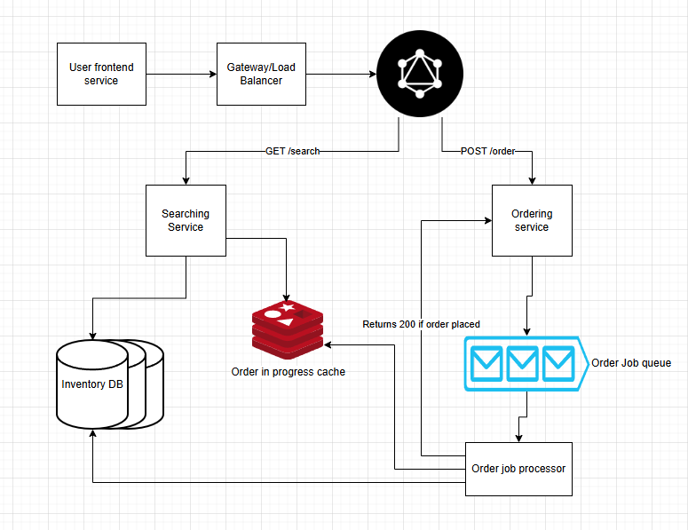

# Delivery service system design

using guide from [here](https://www.hellointerview.com/learn/system-design/problem-breakdowns/gopuff) to get requirements and do post analysis of solution

## Requirements

### Function

- Customers should be able to query availability of items, deliverable in 1 hour, by location (i.e. the effective availability is the union of all inventory nearby DCs).
- Customers should be able to order multiple items at the same time.

### Non-functional

- Availability requests should fast (<100ms) to support use-cases like search.
- Ordering should be strongly consistent: two customers should not be able to purchase the same physical product.
- System should be able to support 10k DCs and 100k items in the catalog across DCs.
- Order volume will be O(10m orders/day)

## Immediate thoughts

- Need a db to store inventory 
  - I think relational makes the most sense because easier to query information about diffrent products
- GraphQL might work well here too for more sophisticated querying over a Rest API
  - Elasticsearch DB might work well too for the searching requirement
- need a message queue to handle jobs for purchases
- DB should be geographicly distributed
- locking for items being purchased? we need to avoid issues for when 2 people buy the same thing at the same time
- heavy horizontal scaling for availability and geo issues

## API

- GET `/search` looks for items in the DB, needs many search properties for diffrent item properties
- POST `/order` orders and item, takes from the DB

## Design Notes

### Components

- **User frontend service**: mobile app or web app that the user searchs from and places orders into 
- **Gateway/load balancer**: Geo-replicated load balancers that directs requests to correct region
   - this can also handel auth
- **Searching service**: GraphQL endpoint for search requests
- **Ordering endpoint** GraphQL endpoint for order requests, separated for better availability
- **Inventory DB**: Database for storing inventory, could use elasicsearch since we need advanced searching
  - Postgres might work well too
  - This should be heavily horizontally scaled and ideally have min 1 per region
- **Order job queue**: Orders jobs go in the queue, 1 per region
  - this is so we don't cause issues with orders causing conflicts
- **Order job processor**: Handle orders and update the database if successful
- **Order in progress cache**: incase an item is being order it can be temporary put on hold so it doesn't appear in searches

### Screenshot
