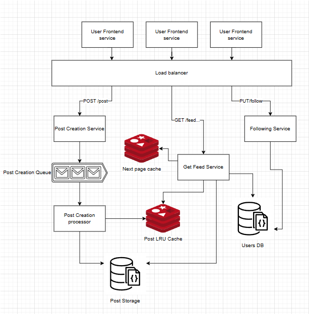

# Ticketmaster system design practice

Using a guide from [here](https://www.hellointerview.com/learn/system-design/problem-breakdowns/fb-news-feed) to get requirements and do post analysis of solution

## Requirements

### Functional

1. Users should be able to create posts.
2. Users should be able to friend/follow people.
3. Users should be able to view a feed of posts from people they follow, in chronological order.
4. Users should be able to page through their feed.

### Non-functional

1. The system should be highly available (prioritizing availability over consistency). We'll tolerate up to 1 minute of post staleness (eventual consistency).
2. Posting and viewing the feed should be fast, returning in < 500ms.
3. The system should be able to handle a massive number of users (2B).
4. Users should be able to follow an unlimited number of users, users should be able to be followed by an unlimited number of users.

## Immediate thoughts

- High availability over consistency to me says a relational database might make sense since they can be horizontally scaled easier
- Geo locating load balancers and services can help make the speed better
- PostDB should be shared heavily for faster read times
- Cache for recently viewed posts (LRU - least recently used by view time)
- users/follows and posts could be in 2 different DBs maybe?

## API

1. POST /post - create a new post for the feed
2. PUT /follow/{id} - friend/follow a user, id of user being followed
3. GET /feed?id={id}&page={pageCount} - grabs content for their feed, id of user making request

## Design screenshot

## Design notes
- **User frontend service** - Web app for the social media platform, horizontally scaled and geo-located
- **Load Balancers** - Redirect traffic to appropriate service for the endpoint the user is hitting
- **Post creation service** - Hosts the endpoint for `/post` the creates a new post
- **Post creation queue** - queues jobs from post creation, helps with redoing jobs when a service goes down
- **Post Creation processor** - submits post to the DB and the Cache
- **Post LRU cache** - store recent posts for fast reads 
- **Post Storage** - stores posts, sharded by some property? 
- **Users DB** - store's users, a property of user is an array of userID that follow them
- **Get Feed Service** - host the endpoint logic for getting a users feed
- **Next page cache** - stores a users next page of post for viewing

## Review thoughts and research into other solutions

- The guide mentioned using dynamoDB, but I figured mongo was good
  - DynamoDB is AWS specific, easy to configure and scale infinitely
- Since following is a many-to-many relationship a graph database would be way better for storing that
- Storing follows in an array is really bad solution
   - Guide recommened a second table for follows using Global Secondary Index (GSI)
- LRU cache was a good idea for posts
