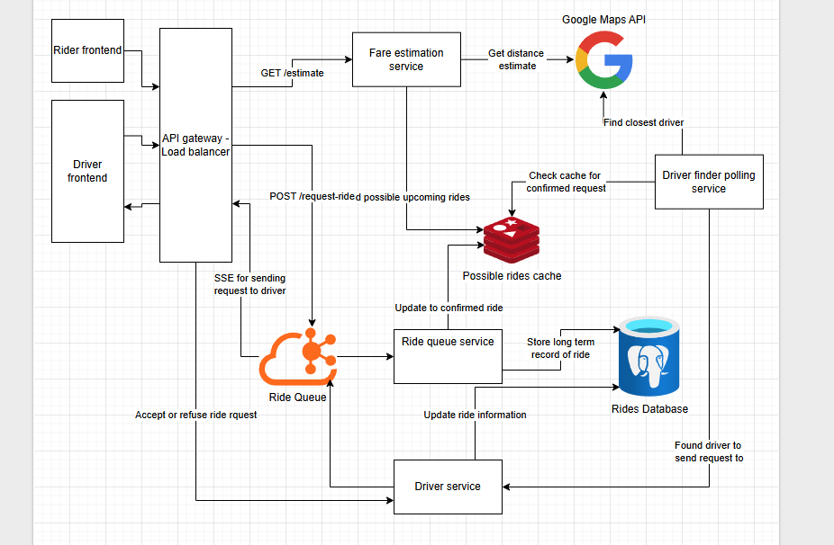

# Delivery service system design

using guide from [here](https://www.hellointerview.com/learn/system-design/problem-breakdowns/uber) to get requirements and do post analysis of solution

## Requirements

### Function

1. Riders should be able to input a start location and a destination and get a fare estimate.
2. Riders should be able to request a ride based on the estimated fare.
3. Upon request, riders should be matched with a driver who is nearby and available.
4. Drivers should be able to accept/decline a request and navigate to pickup/drop-off.

### Non-functional

1. The system should prioritize low latency matching (< 1 minutes to match or failure)
2. The system should ensure strong consistency in ride matching to prevent any driver from being assigned multiple rides simultaneously
3. The system should be able to handle high throughput, especially during peak hours or special events (100k requests from same location)

## Immediate thoughts

- Seperate service that calculate fare estimates
- Kafka messaging queues for speed
- Strong consistency means we need an ACID complaint DB
- Driver locations need to be constantly updated
- Front end service for riders and a different one for drivers

## API

1. POST `/estimate?start={start_loc}&end={destination_loc}` Gets the fare estimate given a starting location and an end location
   - Can create a temporary record for incase the ride is requested so data can be fetched later
   - Returns an ID for the possible ride
2. POST `/requestRide` Requests the ride
3. Server sent event (SSE) to a driver for rider request information
4. POST `/rideAccecptance` driver request to accept or decline a ride

## Design Notes

### Components

- **Rider fronted** - Mobile app the rider users to request fares
- **API gateway/load balancer** - load balancers that go to an API service (horizontally scalable)
- **Fare estimation service** - uses google maps api to get estimate of driving time and create a fare estimate 
- **Possible rides cache** - store ride information for possible rides to be confirmed 
- **Rides Queue** -  Kafka instance for process ride requests and rider acceptance
- **Ride Queue service** - fetches new ride requests data from the cache and adds to DB
- **Driver finder polling service** - poller that looks for rides without a driver and finds the nearest one
- **Driver service** - API that gets request from driver finder and triggers SSE to request a ride from the driver. 
Also, handles the acceptance or refusal request

### Screenshot

## Review thoughts & research into other solutions
