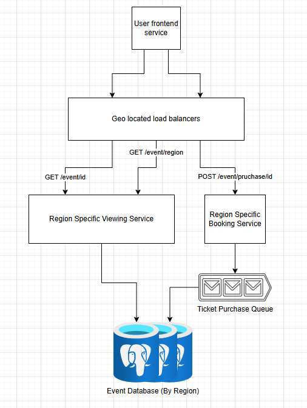

# Ticketmaster system design practice

Using a guide from [here](https://www.hellointerview.com/learn/system-design/problem-breakdowns/ticketmaster) to get requirements and do post analysis of solution

## Requirements

### Functional

1. Users should be able to view events
2. Users should be able to search for events
3. Users should be able to book tickets to events

**Note:** Will not be dealing with reselling, and viewing booked events

### Non-functional

1. The system should prioritize availability for searching & viewing events, but should prioritize consistency for booking events (no double booking)
2. The system should be scalable and able to handle high throughput in the form of popular events (10 million users, one event)
3. The system should have low latency search (< 500ms)
4. The system is read heavy, and thus needs to be able to support high read throughput (100:1)

## Immediate thoughts
- Consistency for booking events means we need an ACID compliant DB and some sort of queue or locking for transactions
- Going to need a high amount or horizontal scaling and load balancing to handel the 10 million users per event and availability
- The DB should be geo-located for event locations
   - This should make the search times lower
- Reading should be its own service

## API

1. GET /events/id - View a specific event
2. GET /events/region - View events in a region
3. POST /events/purchase/id - Book a ticket to a event

## Design screenshot

## Design notes
- **User frontend service** - Mobile or web app that hosts the UI
- **Geo-located load balancers** - Horizontaly scaled load balancers also operated by region, direct traffic to servies
- **Viewing service** - Used for viewing/searching events, hosts the endpoints logic
- **Booking Service** - Used for booking events, hold the endpoint logic and payments logic
   - likely also talks to a service like stripe
- **Purchase Queue** - Used to make sure we don't have ticket's get booked twice
- **Event DB** - Stores data on tickets and events, postgres for acid compliance

## Review thoughts and research into other solutions

- 1st thought was should there be 2 databases, 1 for tickers and another for events
  - The Event viewing DB could be something like elasticsearch for better read speeds 
- Events viewing and searching could have been 2 different services
- Need to mention the DB will use row-level locking or optimistic concurrency control (OCC)
- Adding stripe to the design makes sense to do instead of mentioning it
- You could add a redis cache to temporary store a ticker will payment info is being added so that
a user doesn't lose out on a ticket while entering their information
  - Distributed lock - time to live (TTL)
- Could also use another cache for frequently viewed events
