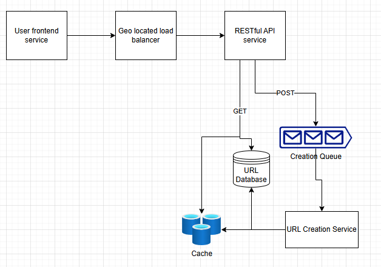

# URL shortener system design notes

## Function requirements

- User can submit a URL and receive a shortened URL
- User can access their shortened URL

## Non-Function requirements

- shortened URL must be unique
- the redirection must have minimal delay 
- Availability over consistency
- Need to support 100 million daily active users and up to 1 billion URLs

## Immediate thoughts
- The only core entity to think about is a URL for this one
- Should use an restful api since the complexity isn't justifiable for graphQL
- A relational DB makes sense here too
- 100M daily user is rougly 1157 requests per second, this will need a heavily 
horizontally scaled system with load balancer. We need to prioritize availability
so geolocating systems makes sense
- Availability can come from geolocating services and having heavily horizontal scaling

## API
1. POST `/` request to create a new shortened URL, should return the new one
2. GET `/{id}` returns a redirection (300 status) to the OG URL

## design notes
- Creation queue is to ensure each generate URL is unique and we don't get collisions
- We can shard the database by URL prefixes or something?
- The cache is for commonly shortened URLs so they can be accessed quickly
- The message queue can be kafka to support large traffic by having different 
brokers for regions or URL's

## Design
